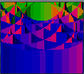
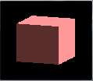

CUDA Rasterizer
===============

**University of Pennsylvania, CIS 565: GPU Programming and Architecture, Project 4**

* Name: William Ho
* Email: willho@seas.upenn.edu
* Tested on: Windows 7 Professional, i7-6700 @ 3.40 GHz 16.0GB, NVIDIA QuadroK620 (Moore 100C Lab)

## Overview

This is an implementation of a GPU rasterization pipeline, designed to simulate the OpenGL graphics pipeline. It implements vertex shading,rasterization, fragment shading, and a framebuffer.

## Basic Rasterizer

|| box.gltf | flower.gltf | cow.gltf |
|:----:|:-----:|:-----:|:-----:|
|Fragment Normals||||
|Lambertian Shading||||

These images are the first images I was able to generate from a basic rasterizer. On an implementation level, I am parallelizing over the primitives in my scene, and iterating through fragment coordinates. These renderings made use of axis-aligned bounding boxes for each primitive to cull the fragments that had to be checked. This optimization, is still quite timely. 

The biggest hurdle in this basic rasterizer is the problem of race conditions that arise when trying to write to the same spaces in the depth buffer. Since a mutex must be used to lock access to those parts of the buffer, the rasterization time performance is considerably impacted. 

## Additional Feature

### Tile Based Approach

With very limited success, I attempted a tile based approach to rasterizing. This involved a preprocess step of parellelizing over triangles in order to bucket them into their overlapping tiles, and then parallelizing over the tiles. The most significant advantage to this was the ability to use shared memory within tiles to avoid the common global memory accesses to the depth buffer that previously choked my naive rasterizer. With this approach, I was able to speed up the rasterization step considerably for `box.gltf`. With my naive rasterizer on the machine I was working on, I did not succeed in rendering `box.gltf` at higher than `100x100` pixel resolution because the rasterization kernel would exceed the NVIDIA timeout limit. Tiling allowed me to render up to `800x800` pixel resolution. In many ways, this seems promising.

However, a truly robust implementation of this approach would have to overcome several hurdles. First off, as evidenced in the above image, there are many visual artifacts that need to be addressed. More important, preprocessing triangles into buckets requires race condition handling, which, for any mesh with significant numbers of triangles, is far worse than my naive rasterizer implementation. As a result, I have not yet rendered successfully any higher polygon meshes, due to the timeout limit as stated above. 

## Credits

* [tinygltfloader](https://github.com/syoyo/tinygltfloader) by [@soyoyo](https://github.com/syoyo)
* [glTF Sample Models](https://github.com/KhronosGroup/glTF/blob/master/sampleModels/README.md)
